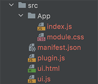

# Figma plugin API человеческим языком
### Часть 3
## Подключаем React

install project
    
    npm i 

development build project

    npm run start

publish build project

    npm run build

[<< Часть 2 Взаимодействие с Figma](https://habr.com/ru/post/589819/)

В предыдущих двух статьях я описал, как без особых усилий можно начать писать плагин для Figma. И для того, чтобы сделать простой плагин, этого знания вполне достаточно. Но вот если интерфейс вашего плагина более сложный, чем пара кнопок и инпутов, если наворочена логика состояний, такой подход становится неудобен. Особенно учитывая, что весь код надо писать в html. Решить данную проблему нам поможет его величество [React](https://www.figma.com/plugin-docs/bundling-react/) и его преосвященство [Webpack](https://www.figma.com/plugin-docs/bundling-webpack/). Подключение к плагину обеих технологий хорошо описаны в официальной документации Figma. И можно было не писать эту статью если бы не одно но, официальная инструкция не работает. А раз так, поехали!

Проект я разворачиваю на [**node**](https://nodejs.org/ru/) версии **17.1.0** и [**npm**](https://www.npmjs.com/) версии **8.1.2**

И так, открываем проект и в терминале выполняем команду:

    npm init

Далее устанавливаем инструменты разработки

    npm install --save-dev css-loader html-webpack-inline-source-plugin@beta html-webpack-plugin copy-webpack-plugin style-loader file-loader url-loader webpack webpack-cli babel-loader @babel/preset-env @babel/preset-react

Устанавливаем react

    npm install --save react-dom react

Теперь создадим в корне проекта папку **src** и в ней следующую иерархию файлов:

Рассмотрим содержимое этих файлов. Начнем с **manifest.json**

    {
        "name": "Figma Plugin with React",
        "api": "1.0.0",
        "main": "./plugin.js",
        "ui": "./ui.html",
        "editorType": [
            "figma"
        ]
    }

Тут все тоже, что и в предыдущих примерах, с той лишь разницей, что пути мы пишем относительно текущего файла, а не корня проекта.

Теперь взглянем на **ui.html**. В него мы добавляем **body**, чуть позже поясню зачем, а так же контейнер для нашего проекта.

    <body>
       

    </body>

Следующим идет **ui.js**

    import React from 'react';
    import ReactDom from 'react-dom';
    import App from './App';
    
    ReactDom.render(
        <App />,
        document.querySelector('#figma-plugin-container')
    );

Тут мы импортируем **react** и **react-dom**, а также модуль **App**, который рендерим в контейнере проекта.

В файле **plugin.js** мы пока что только отобразим окно плагина.

    figma.showUI (
        __html__,
        {width: 400, height: 400}
    );

Файл **App/index.js** и **App/module.css** пока что тоже оставим дефолтными, наполнять их будем позже

_App/index.js_

    import React from "react";
    
    export default function App() {
        return (
            

        
           

        )
    }

_App/module.css_

    body, html {
        padding: 0;
        margin: 0;
        width: 100%;
        height: 100%;
    }
    .app {
        box-sizing: border-box;
        width: 100%;
        height: 100%;
        padding: 10px;
    }

Каркас проекта готов. Теперь создадим  в корне файл **webpack.config.js** следующего содержания.

    const HtmlWebpackInlineSourcePlugin = require('html-webpack-inline-source-plugin');
    const HtmlWebpackPlugin = require('html-webpack-plugin');
    const CopyWebpackPlugin = require('copy-webpack-plugin');
    const path = require('path');
    
    module.exports = (env, argv) => ({
        mode: argv.mode === 'production' ? 'production' : 'development',
        
        devtool: argv.mode === 'production' ? false : 'inline-source-map',
        
        entry: {
            ui: './src/ui.js',
        },
        
        module: {
            rules: [
                {
                    test: /\.m?js$/,
                    exclude: /node_modules(?!\/ansi-regex)(?!\/strip-ansi)/,
                    use: {
                        loader: 'babel-loader',
                        options: {
                            presets: [
                                '@babel/preset-env',
                                '@babel/react',
                                {
                                    plugins: ['@babel/plugin-proposal-class-properties'],
                                },
                            ],
                        },
                    },
                },
                { test: /\.css$/, use: ['style-loader', { loader: 'css-loader' }] },
                { test: /\.(png|jpg|gif|webp|svg)$/, loader: 'url-loader' },
                {
                    test: /\.(png|jpe?g|gif)$/i,
                    loader: 'file-loader',
                }
            ],
        },
            
        resolve: {
            extensions: ['.jsx', '.js'],
            modules: [
                path.resolve(__dirname, 'node_modules'),
                path.resolve(__dirname, 'src'),
                path.resolve(__dirname, ''),
            ],
        },
        
        output: {
            filename: '[name].js',
            publicPath: "/",
        },
        
        plugins: [
            new HtmlWebpackPlugin({
                template: "./src/ui.html",
                filename: "ui.html",
                inlineSource: ".(js)$",
                inject: "body",
                cache: false,
            }),
            new HtmlWebpackInlineSourcePlugin(HtmlWebpackPlugin),
            new CopyWebpackPlugin({
                patterns: [{
                    from: './src/plugin.js',
                    to: '',
                }, {
                    from: './src/manifest.json',
                    to: '',
                }],
            })
        ],
    })

Не стану подробно его расписывать. Если у вас вызывает недоумение этот скрипт, предлагаю ознакомиться с официальной [документацией](https://webpack.js.org/guides/) **webpack**. Обращу только ваше внимание на строку

    inject: "body"

отсутствие которой в официальном [гайде](https://www.figma.com/plugin-docs/bundling-webpack/) Figma вызывает ошибку плагина HtmlWebpackInlineSourcePlugin. Вот собственно зачем нам понадобился body в **ui.html**. Туда webpack поместит скрипт из файла **ui.js**.

Вот собственно и все, нам осталось только добавить в **package.json**  пару скриптов

    "scripts": {
        "start": "npx webpack --mode=development --watch",
        "build": "npx webpack --mode=production"
    }

Скрипт **start** запустит сборку в режиме **development**, а флаг **-watch** указывает на необходимость пересобрать проект при изменениях. Срипт же **build** сделает сборку в режиме **production**, а значит готовую к публикации.

Заходим в терминал. Запускаем команду

    npm run start

В проекте появится папка **dist** со сборкой плагина. Импортировов плагин из файла **manifest.json** этой папки, вы получите свой плагин, собранный на основе react.

Код данного примера вы найдете [тут](https://gitlab.com/figma-plugin-examples/figma-plugin-with-react). Теперь вы всегда сможете использовать его, как шаблон плагина для Figma.